

# About

Encode a well-known book as a series of QR codes. Just a silly demo project.

# Texts

### L’Albatros
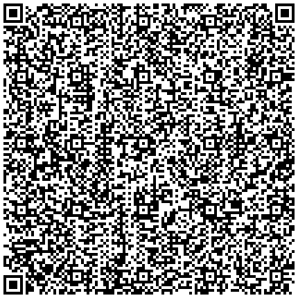
### Correspondances

### La Muse malade
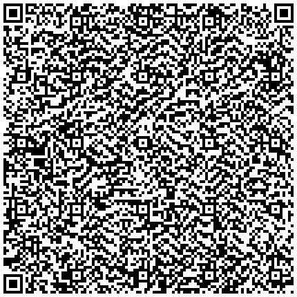
### La Muse vénale
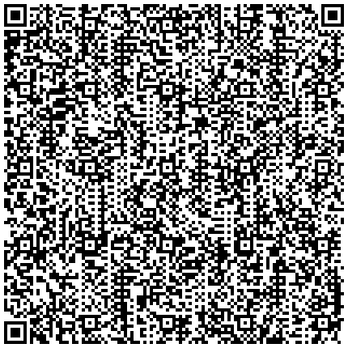
### Le Mauvais Moine
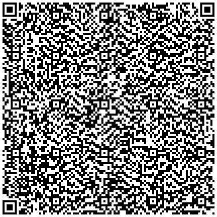
### L’Ennemi
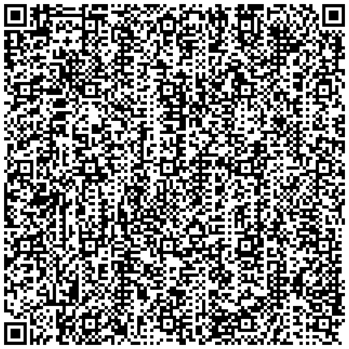
### Le Guignon
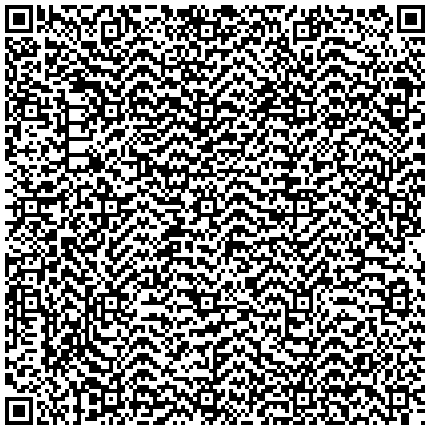
### La Vie antérieure
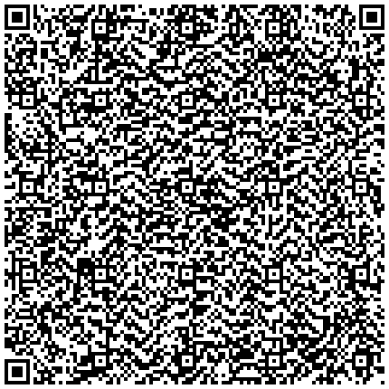
### Bohémiens en voyage
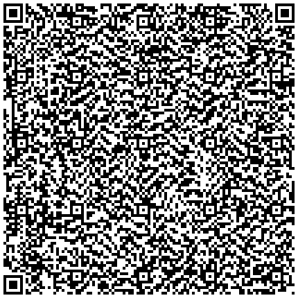
### L’Homme et la mer
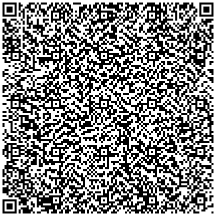
### La Beauté

### L’Idéal
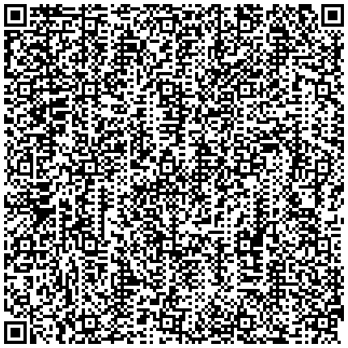
### La Géante
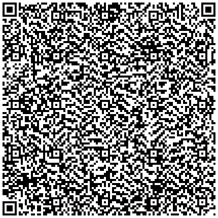
### Parfum exotique
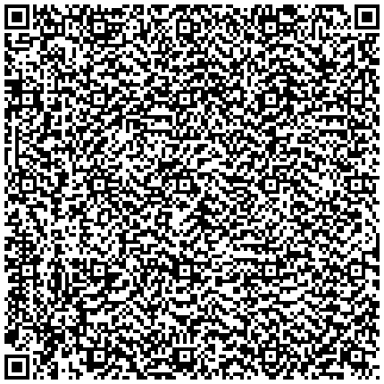
### Je t’adore à l’égal de la voûte nocturne
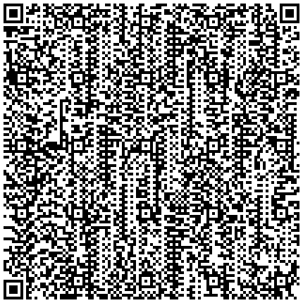
### Tu mettrais l’univers entier dans ta ruelle
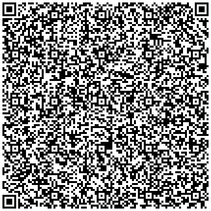
### Sed non satiata
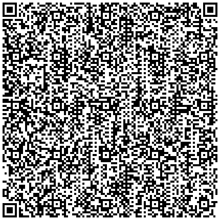
### Avec ses vêtements ondoyants et nacrés
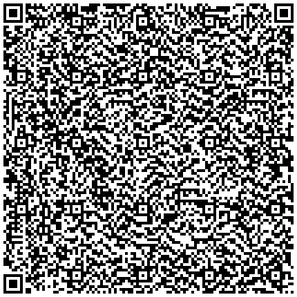
### De profundis clamavi
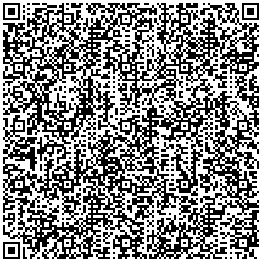
### Le Vampire
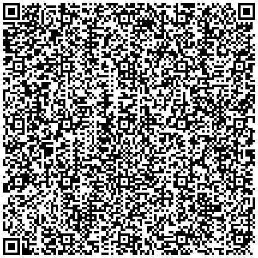
### Une nuit que j’étais près d’une affreuse Juive
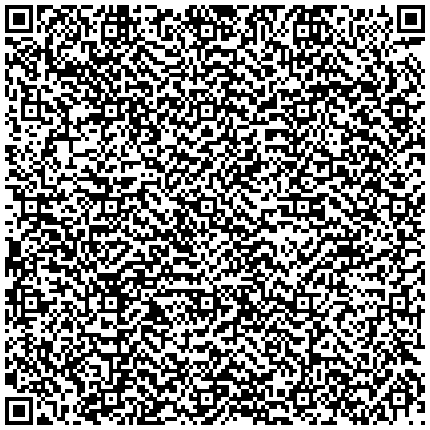
### Remords posthume
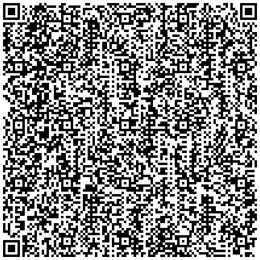
### Le Chat
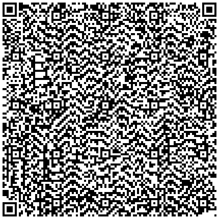
### Duellum
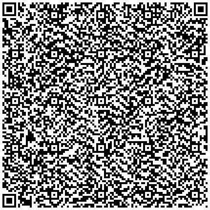
### Le Possédé

### Je te donne ces vers afin que si mon nom
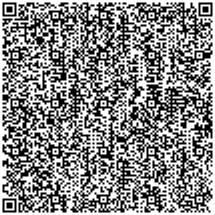
### Semper Eadem
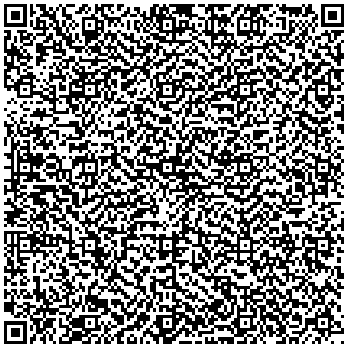
### Tout entière
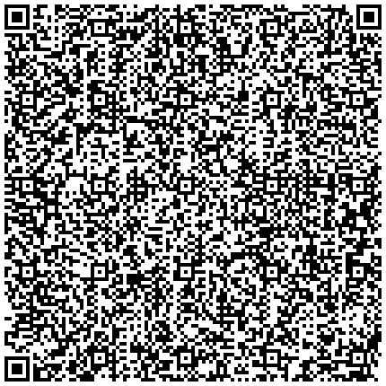
### Que diras-tu ce soir, pauvre âme solitaire
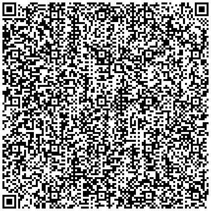
### Le Flambeau vivant
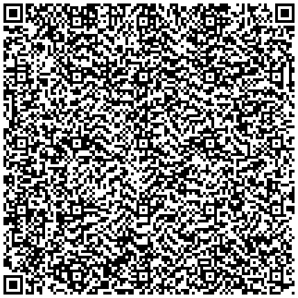
### L’Aube spirituelle
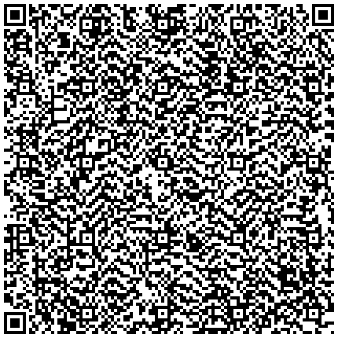
### Harmonie du soir
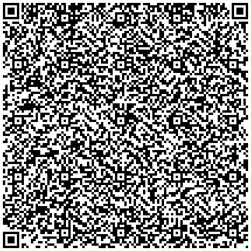
### Le Poison
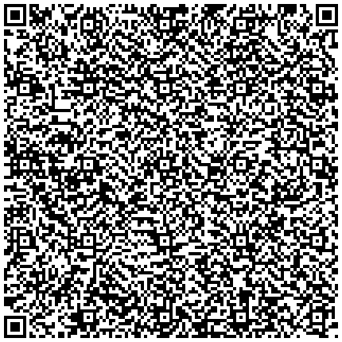
### Ciel brouillé

### Causerie
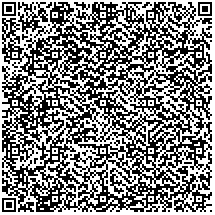
### Sisina
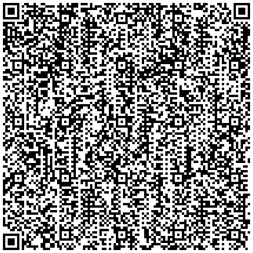
### Franciscae meae laudes
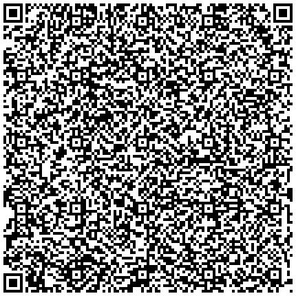
### À une dame créole
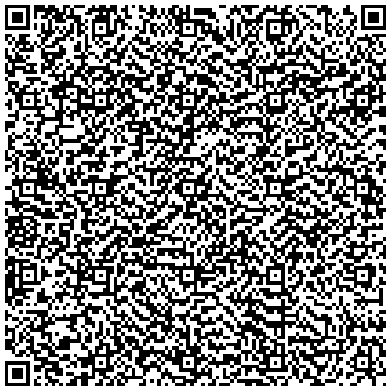
### Le Revenant
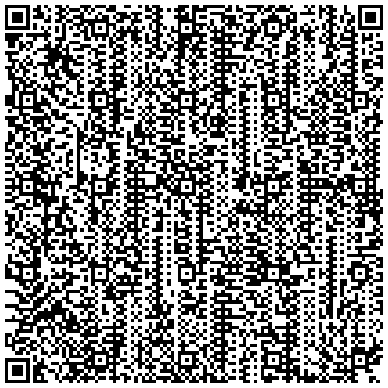
### Sonnet d’automne
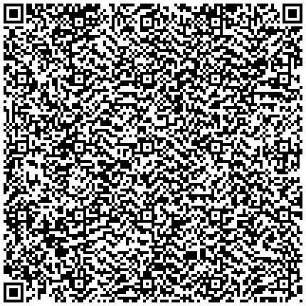
### Tristesses de la lune
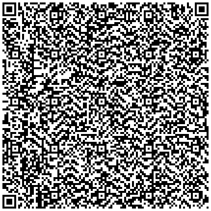
### Les Chats
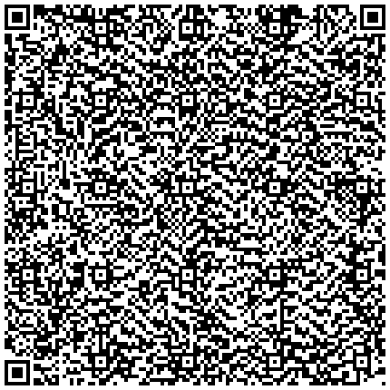
### Les Hiboux
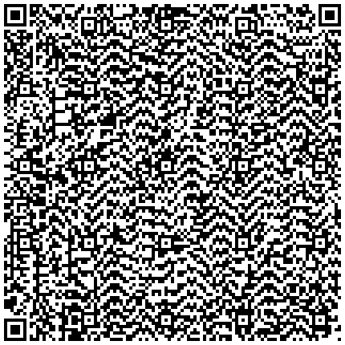
### La Pipe
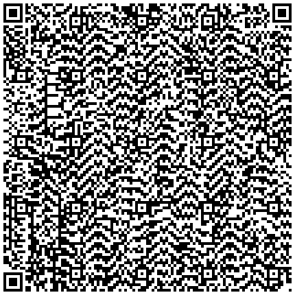
### La Musique
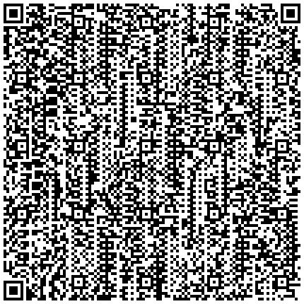
### Sépulture

### Une gravure fantastique

### Le Mort joyeux
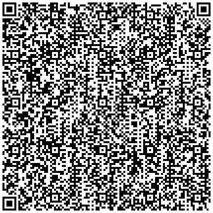
### Le Tonneau de la haine
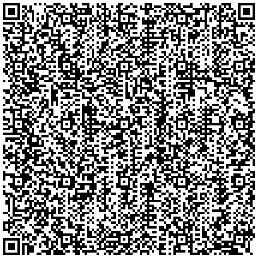
### La Cloche fêlée
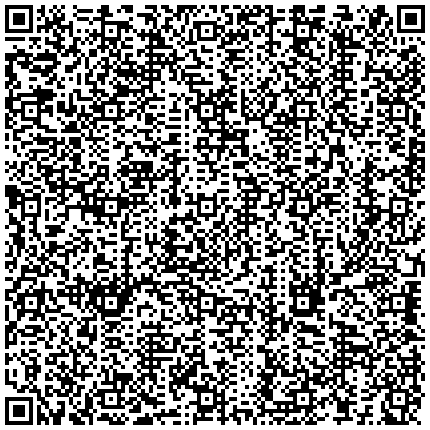
### Spleen (1)
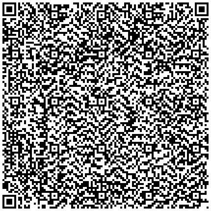
### Spleen (3)
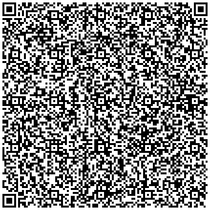
### Obsession
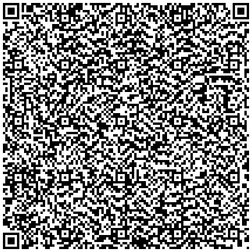
### Le Goût du néant
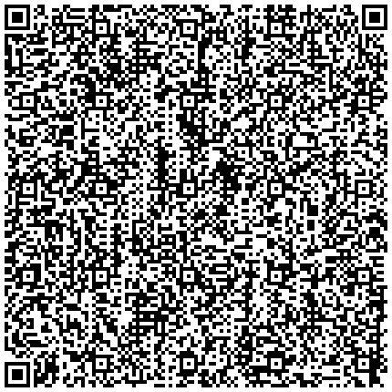
### Alchimie de la douleur

### Horreur sympathique
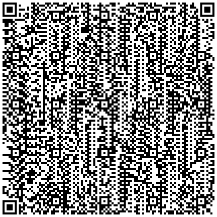
### L’Héautontimorouménos
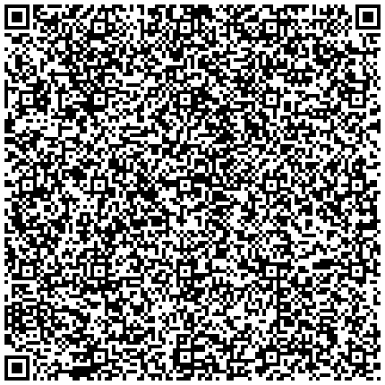
### Les Aveugles

### À une passante

### Je n’ai pas oublié

### Brumes et pluies

### Le Vin du solitaire

### Le Vin des amants

### La Destruction

### Les Deux Bonnes Sœurs

### La Fontaine de sang

### L’Amour et le crâne

### Prière

### La Mort des amants

### La Mort des pauvres

### La Mort des artistes

### La Fin de la journée

### Le Rêve d’un curieux
